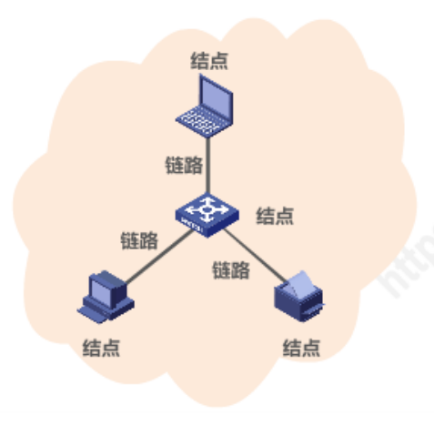
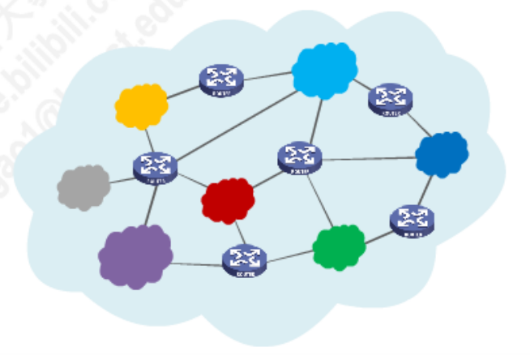
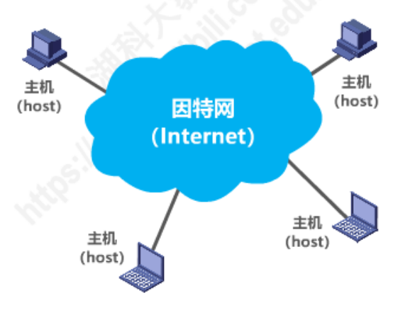
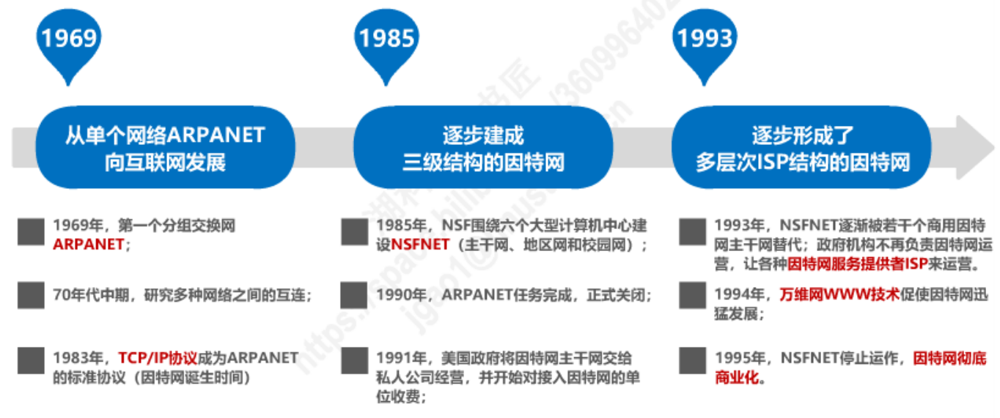
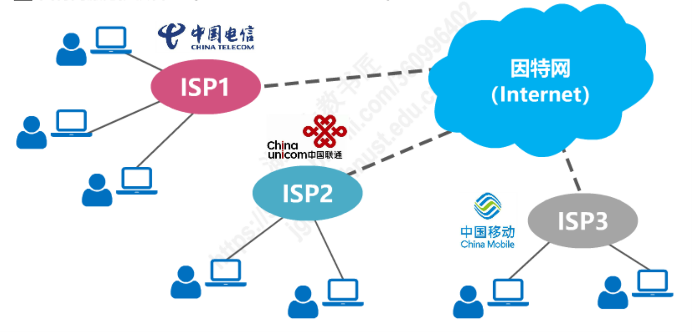
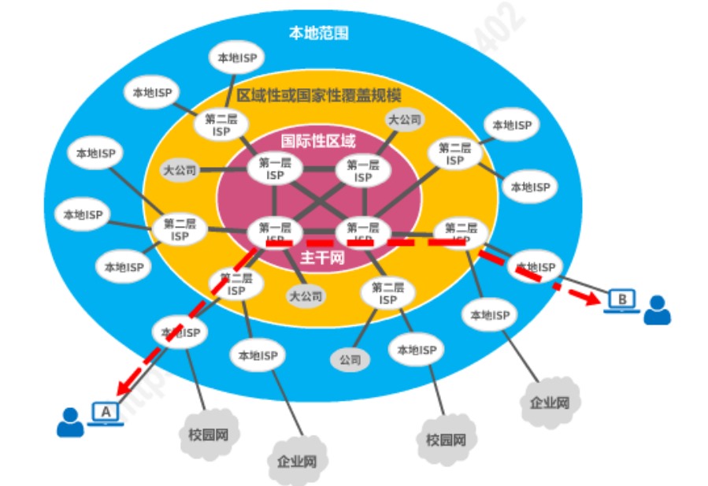
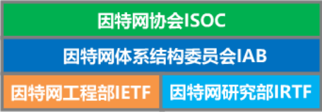

[toc]

# 因特网概述

## 网络、互联网与因特网

> **网络**(Network)：由若干**结点(Node)**和连接这些结点的**链路(Link)**组成。
>
> 多个网络还可以通过路由器互连起来，这样就构成了一个覆盖范围更大的网络。即，**互联网**。
> 因此，互联网是“**网络的网络(Network of Networks)**”。
>
> **因特网(Internet)**是世界上最大的互联网络。(用户数以万计，互联的网络数以百万计)

​           

### internet 与 Internet 的区别

> ​	internet(互联网)是一个通用名词。它泛指由多个计算机网络互联而成的网络，在这些网络之间的通信协议可以是任意的。
>
> ​	Internet(因特网)是一个专用名词。它指当前全球最大的、开放的、由众多网络相互连接而成的特定计算机网络。它采用 TCP/IP 协议族作为通信的规则，其前身是美国的 ARPANET。

## 因特网的发展三个阶段

### 因特网服务提供者ISP(Internet Service Provider)

> ​	ISP 可以从因特网管理机构申请到成块的 IP 地址，同时拥有通信线路和路由器等连网设备。
>
> ​	任何机构和个人，只要向 ISP 缴纳规定的费用，即可从 ISP 中获得所需要的 IP 地址。

### 基于 ISP 的三层结构的因特网

> ​	根据提供服务的覆盖面积大小，及所拥有的 IP 地址数量的不同，ISP 也分成不同的层次。
>
> ​	第一层 ISP(因特网主干网)：
> ​		服务面积最大，一般能覆盖国际性区域范围；拥有高速链路和交换设备。第一层 ISP 之间直接互联。
>
> ​	第二层 ISP 和大公司：
> ​		是第一层 ISP 的用户。通常具有区域性或这国家性覆盖规模，与少数第一层 ISP 相连接。
>
> ​	第三层 ISP(本地 ISP)：
> ​		是第二层 ISP 的用户。只拥有本地范围的网络。一般的校园网或企业网，住宅用户和无线移动用户，都是第三层 ISP 的用户。
>
> ​	一旦某个用户能够接入到因特网，那么他也能成为一个 ISP(调制解调器、路由器等设备)。

## 因特网的标准化工作

> - 因特网的标准化工作对因特网的发展起到了非常重要的作用。
>
> - 因特网在制定其标准上的一个很大的特点是__面向公众__。
>
>     - 因特网所有的__RFC(Request For Comments)__技术文档都可以从因特网上免费下载：
>         	<https://www.ietf.org/rfc/>
>     - 任何人都可以随时用电子邮件发表对某个文档的意见或建议。
>     
> - __因特网协会 ISOC__是一个国际性组织，它负责对因特网进行全面管理，以及在世界范围内促进其发展和使用。
>
>     - 因特网体系结构委员会 IAB，负责管理因特网有关协议的开发。
>     - 因特网工程部 IETF，负责研究中短期工程问题，主要针对协议的开发和标准化。
>     - 因特网研究部 IRTF，从事理论方面的研究和开发一些需要长期考虑的问题。
>
> - 指定因特网的正式标准需要经过 4 个阶段：
>
>     - 因特网草案(该阶段还不是 RFC 文档)。
>     - 建议标准(从这个阶段开始就成为 RFC 文档)。
>     - 草案标准。
>     - 因特网标准。
>
>     注意：不是所有的 RFC 文档都是因特网标准，只有少部分 RFC 文档才能成为因特网标准。

## 因特网的组成

### 从*功能*上看

> - 边缘部分
>     	由所有连接在因特网上的__主机__组成。这部分是__用户直接使用的__，用来进行__通信(传输数据、音频或视频)__和__资源共享__。
> - 核心部分
> 		由__大量网络__和连接这些网络的__路由器__组成。这部分是__为边缘部分提供服务的(提供连通性和交换)。__ 
> 		在网络核心部分起特殊作用的是路由器。它是一种专用计算机，但我们不称它为主机。路由器是实现[分组交换](3-三种交换方式.md)的关键构件，其任务是转发收到的分组。 

