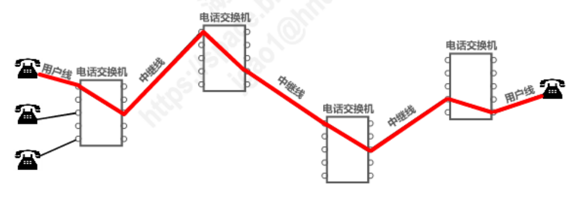
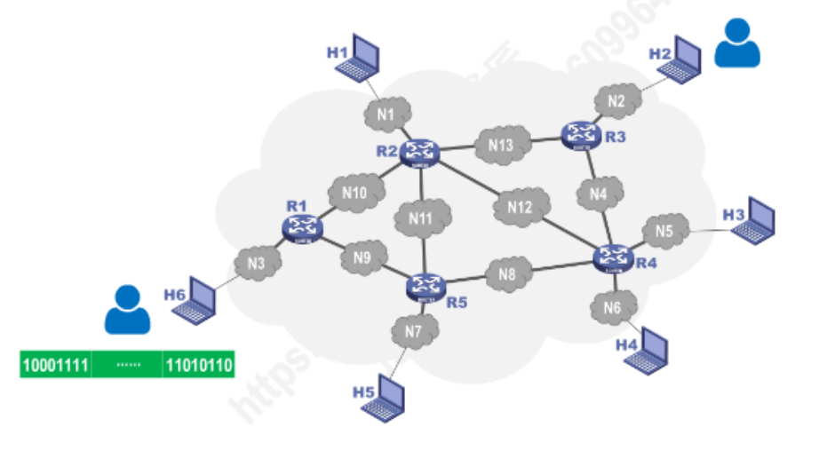
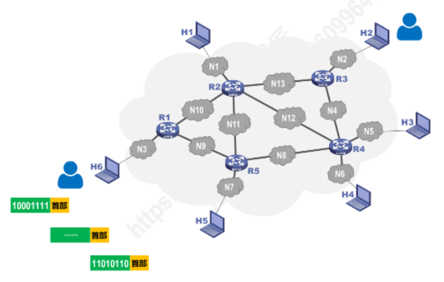
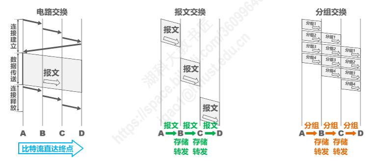

[toc]

# 交换方式

## 电路交换(Circuit Switching)

> 电话交换机接通电话线的方式称为电路交换。
>
> 从通信资源的分配角度来看，交换(Switching)就是按照某种方式动态地分配传输线路的资源。
>
> 电路交换的三个步骤：
>
>   1. 建立连接(分配通信资源)
>   2. 通话(占用通信资源)
>   3. 释放资源(归还通信资源)

### 使用电路交换来传输计算机数据，此方法是否可行？

> ​	此方法可行，但线路的传输的效率很低。
>
> ​	因为计算机数据是突发式的出现在传输线路上的，且当一名用户占用了通信资源时，而他所做的操作(正在输入和编辑一份文件时)，他占用的通信资源未被利用，其他用户也不能使用。

## 分组交换(Packet Switching)

> ​	计算机网络通常采用分组交换，而不是电路交换。
>
> ​	在因特网中，最重要的分组交换机就是路由器。它负责将各个网络互连起来，并对接收到的分组进行转发，即进行分组交换。
>
> ​	假设 H6 需要向 H2 发送一条消息。
> ​	通常我们把表示该消息的整块数据称为一个报文。
>
> ​	在发送报文之前，先把较长的报文划分为一个个更小的等长数据段。在每个数据段前面(首部)，加上一些由必要的控制信息组成的首部后，就构成了一个分组，也可简称为“包”。相应的，首部也可称为“包头”。
>
> ​	在发送过程中，每个路由器检查分组的首部信息，选取合适的线路进行发送。
>
> ​	在接收报文之后，将每个分组的首部去掉，之后将数据段进行拼接还原。

### 分组交换

| 发送方                 | 路由器                 | 接收方                 |
| ---------------------- | ---------------------- | ---------------------- |
| 构造分组 发送分组 | 缓存分组 转发分组 | 接收分组 还原报文 |

## 报文交换

> ​	主要用于早期的电报通信网，现在较少使用，通常被先进的分组交换所取代。

## 电路交换、分组交换、报文交换的对比

### 电路交换的优缺点

#### 优点

1. 通信时延小：
2. 有序传输
3. 没有冲突
4. 使用范围广
5. 实时性强
6. 控制简单

#### 缺点

1. 建立连接时间长
2. 线路独占，使用效率低
3. 灵活性差
4. 难以规格化

### 报文交换的优缺点

#### 优点

1. 无需建立连接
2. 动态分配线路
3. 提高线路可靠性
4. 提高线路利用率
5. 提供多目标服务

#### 缺点

1. 引起了转发时延
2. 需要较大的存储缓存空间
3. 需要传输额外的信息量

### 分组交换的优缺点

#### 优点

1. 无需建立连接
2. 线路利用率高
3. 简化了存储管理
4. 加速传输
5. 减少出错概率和重发数据量

#### 缺点

1. 引起了转发时延
2. 需要传输额外的信息量
3. 对于数据报服务，存在失序、丢失和重复分组的问题。
    对于虚电路服务，存在呼叫建立、数据传输和虚电路释放三个过程。